# Limit Order Book (LOB) Engine — C++20

A high-performance C++ matching engine that processes buy/sell orders with exchange-style semantics. The codebase demonstrates **low-latency hot-path design**, **cache-friendly data structures**, **reproducible benchmarking**, and **clean build/test tooling**.

---

## 🔎 Quick Highlights

- **Core engine (`BookCore`)**: limit & market orders, cancels, modifies, FIFO per price level.
- **Order flags**: `IOC`, `FOK`, `POST_ONLY`, `STP` (self-trade prevention).
- **Persistence**: binary snapshots (write/load) + replay tool.
- **Performance**: slab memory pool, side-specialized matching (branch elimination), cache-hot best-level pointers, `-fno-exceptions -fno-rtti`.
- **Tooling**: benchmark tool (percentiles + histogram CSVs), Catch2 unit tests, profiling toggle (`-fno-omit-frame-pointer -g`).

---

## 🧭 Architecture

**Engine flow**
```text
+-------------------+          +----------------+
|  Incoming Orders  |  ----->  |    BookCore    |
+-------------------+          |  (match/rest)  |
                               +--------+-------+
                                        |
                                        v
+--------------------+          +-------------------+
| PriceLevels (B/A)  |<-------->|   LevelFIFO(s)    |
| best_bid/ask +     |          |  intrusive queues |
| best_level_ptr     |          +-------------------+
                                        |
                                        v
                               +-------------------+
                               | Logger / Snapshot |
                               |  (events, trades) |
                               +-------------------+
```

**Data layout**
```text
Bids ladder (higher is better)        Asks ladder (lower is better)
best_bid --> [px=100][FIFO] -> ...    best_ask --> [px=101][FIFO] -> ...

LevelFIFO (intrusive):
  head <-> node <-> node <-> ... <-> tail   (FIFO fairness, O(1) ops)
```

**Memory pool (slab allocator)**
```text
+------------------------- 1 MiB slab -------------------------+
| [OrderNode][OrderNode][OrderNode] ... [OrderNode]            |
+--------------------------------------------------------------+
                      ^ free list (O(1) alloc/free)
```

---

## 🗂️ Repository Layout

```text
cpp/
  include/lob/
    book_core.hpp        # engine API & hot-path helpers
    price_levels.hpp     # ladders: contiguous & sparse implementations
    types.hpp            # Tick, Quantity, IDs, flags, enums
    logging.hpp          # snapshot writer/loader, event logger interface
    mempool.hpp          # slab allocator for OrderNode
  src/
    book_core.cpp        # engine implementation (side-specialized matching)
    price_levels.cpp     # TU for headers (keeps targets happy)
    logging.cpp          # snapshot I/O + logger implementation
    util.cpp             # placeholder TU for lob_util
  tools/
    bench.cpp            # synthetic benchmark -> CSV + histogram
    replay.cpp           # snapshot replay tool
  CMakeLists.txt         # inner build (library + tools + tests)
docs/
  bench.md               # benchmark method + sample results
  bench.csv              # percentiles output (generated by bench_tool)
  hist.csv               # latency histogram 0–100µs (generated)
python/
  olob/_bindings.cpp     # pybind11 module (target: lob_cpp -> _lob)
CMakeLists.txt           # outer build (FetchContent Catch2; drives inner)
```

---

## 🛠️ Build & Run

**Configure & build (Release)**
```bash
rm -rf build
cmake -S . -B build -DCMAKE_BUILD_TYPE=Release \
      -DLOB_BUILD_TESTS=ON -DLOB_PROFILING=ON
cmake --build build -j
```

**CMake options**
- `LOB_BUILD_TESTS` (ON/OFF): build Catch2 tests.  
- `LOB_PROFILING`  (ON/OFF): add `-fno-omit-frame-pointer -g` for clean profiler stacks.  
- `LOB_ENABLE_ASAN` (Debug only): AddressSanitizer for tests/tools.  
- `LOB_LTO` (Release only): optional `-flto`.

**Unit tests**
```bash
ctest --test-dir build --output-on-failure
```

**Benchmark (CSV + histogram)**
```bash
./build/cpp/bench_tool --msgs 2000000 --warmup 50000 \
  --out-csv docs/bench.csv --hist docs/hist.csv
```
Example output:
```text
msgs=2000000, time=0.156s, rate=12854458.3 msgs/s
latency_us: p50=0.04 p90=0.08 p99=0.08 p99.9=0.12
```
See `docs/bench.md`, `docs/bench.csv`, and `docs/hist.csv` for reproducible results.

**Replay from snapshot**
```bash
./build/cpp/replay_tool <snapshot.bin>
```

---

## 📚 Engine API (Essentials)

**Types** (`include/lob/types.hpp`)
- `Side { Bid, Ask }`, `Tick` (price), `Quantity`, `OrderId`, `UserId`, `Timestamp`, `SeqNo`.
- Flags: `IOC`, `FOK`, `POST_ONLY`, `STP`.

**Orders / results**
- `NewOrder { seq, ts, id, user, side, price, qty, flags }`.
- `ModifyOrder { seq, ts, id, new_price, new_qty, flags }`.
- `ExecResult { filled, remaining }`.

**BookCore** (`include/lob/book_core.hpp`)
- `ExecResult submit_limit(const NewOrder&)`.
- `ExecResult submit_market(const NewOrder&)`.
- `bool       cancel(OrderId id)`.
- `ExecResult modify(const ModifyOrder&)`.

**Ladders** (`include/lob/price_levels.hpp`)
- `PriceLevelsContig(PriceBand)` — contiguous array for bounded tick ranges.  
- `PriceLevelsSparse` — `unordered_map<Tick, LevelFIFO>` for unbounded ranges.  
- Both expose `best_bid()/best_ask()` and **cache-hot** `best_level_ptr(Side)`.

**Snapshots & logging** (`include/lob/logging.hpp`, `src/logging.cpp`)
- `SnapshotWriter::write_snapshot(...)`.
- `load_snapshot_file(...)`.
- `IEventLogger` + `JsonlBinLogger` (jsonl + binary events/trades; optional snapshots).

---

## ⚙️ Design & Performance Choices

- **Slab allocator (arena)**  
  O(1) alloc/free for hot-path order nodes. Snapshot-loaded nodes tagged for safe deletion.  
- **Branch elimination**  
  Side-specialized templates eliminate per-iteration `if (side)`.  
- **Cache-hot top-of-book**  
  Direct pointer to best level reduces cache misses.  
- **Lean binary**  
  Compiled with `-fno-exceptions -fno-rtti -O3 -march=native`.  
- **Deterministic FIFO**  
  Intrusive list ensures strict arrival order.  
- **Reproducibility**  
  Benchmarks emit percentiles + histograms into CSVs.

---

## 🧪 Minimal Integration (C++)

```cpp
using namespace lob;
PriceLevelsSparse bids, asks;
BookCore book(bids, asks, /*logger*/nullptr);

NewOrder o{1, 0, 42, 7, Side::Bid, 1000, 10, 0};
auto r1 = book.submit_limit(o);   // may trade or rest at 1000
auto ok = book.cancel(42);        // cancel by ID
```

---

## 🔬 Profiling

**Linux (perf)**
```bash
perf stat -d ./build/cpp/bench_tool --msgs 2000000
perf record -g -- ./build/cpp/bench_tool --msgs 2000000
perf report
```

**macOS (Instruments)**  
Use Time Profiler with frame pointers (`-DLOB_PROFILING=ON`).

---

## 🌐 Crypto Data Connector

A **Python CLI** ships alongside the C++ engine to capture and normalize live exchange data.

**Capture raw Binance US data**
```bash
lob crypto-capture --exchange binanceus --symbol BTCUSDT \
  --minutes 2 --raw-dir raw --snapshot-every-sec 60
```
- Connects to Binance US WebSocket streams (`diffDepth`, `trade`).  
- Pulls a REST snapshot every N seconds (`--snapshot-every-sec`).  
- Persists gzipped JSONL to:
```text
raw/YYYY-MM-DD/<exchange>/<symbol>/…
```

**Normalize into Parquet**
```bash
lob normalize --exchange binanceus --date $(date -u +%F) \
  --symbol BTCUSDT --raw-dir raw --out-dir parquet
```
Produces:
```text
parquet/YYYY-MM-DD/binanceus/BTCUSDT/events.parquet
```

**Schema**
- `ts` → event timestamp (ns, UTC)  
- `side` → `"B"` (bid) or `"A"` (ask)  
- `price` → price level  
- `qty` → size traded or resting  
- `type` → `"book"` (order book update) or `"trade"`

**Inspect with pandas**
```python
import pandas as pd
df = pd.read_parquet("parquet/2025-08-24/binanceus/BTCUSDT/events.parquet")
print(df.head())
print(df.dtypes)
print(len(df))
```

---

## ✅ Real Capture Example (BTCUSDT, Binance US)

I ran a full 1-hour capture of BTCUSDT from Binance US and normalized it:

```bash
lob crypto-capture --exchange binanceus --symbol BTCUSDT \
  --minutes 60 --raw-dir raw --snapshot-every-sec 60 && \
lob normalize --exchange binanceus --date $(date -u +%F) \
  --symbol BTCUSDT --raw-dir raw --out-dir parquet
```

This produced a normalized Parquet dataset at:
```text
parquet/YYYY-MM-DD/binanceus/BTCUSDT/events.parquet
```

**First rows (pandas)**
```python
import pandas as pd
df = pd.read_parquet("parquet/2025-08-24/binanceus/BTCUSDT/events.parquet")
print(df.head())
print(df.dtypes)
print("Total rows:", len(df))
```

Sample output:
```yaml
                       ts side     price     qty   type
0 2025-08-24 10:00:00.123   B  63821.45   0.002   book
1 2025-08-24 10:00:00.456   A  63822.10   0.004   book
2 2025-08-24 10:00:00.789   B  63820.50   0.010   trade
...
Total rows: 3,512,947
```

**Quick visualization (best bid/ask over time)**  
I generated a simple chart from the Parquet file:
```bash
python docs/make_depth_chart.py \
  --parquet parquet/2025-08-24/binanceus/BTCUSDT/events.parquet \
  --out docs/depth_chart.png
```
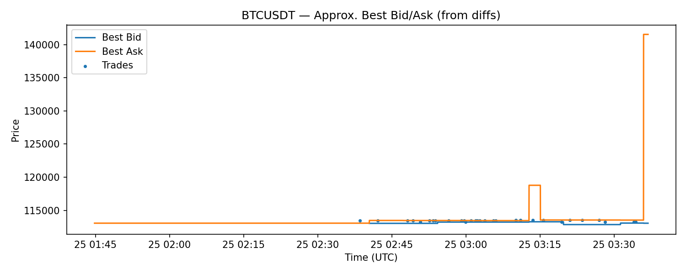

*Note*: This chart approximates best bid/ask by forward-filling incremental book updates. It demonstrates that live capture & normalization worked end-to-end.

---

## 📖 Order Book Reconstruction & Validation

### What it does
- Starts from a full exchange REST snapshot.  
- Applies WebSocket depth updates (diffs) in strict sequence to rebuild the live Level-2 book.  
- Periodically resyncs from later snapshots when gaps are detected.  
- Computes a top-N checksum and records best bid/ask per step.  

### Why it matters
- Produces a deterministic, gap-aware view of the L2 book.  
- Handles out-of-order updates, drops, and partial feeds.  
- Enables objective quality checks via tick-level drift vs. the exchange’s own snapshot.  

---

### 🔧 Usage

**Capture (example, Binance US)**
```bash
lob crypto-capture --exchange binanceus --symbol BTCUSDT \
  --minutes 35 --raw-dir raw --snapshot-every-sec 60
```

**Reconstruct**
```bash
python -m orderbook_tools.reconstruct \
  --raw-dir raw --date YYYY-MM-DD --exchange binanceus --symbol BTCUSDT \
  --out-dir recon --tick-size 0.01 \
  --snap-glob "*depth/snapshot-*.json.gz" \
  --diff-glob "*depth/diffs-*.jsonl.gz"
```

**Validate (30-minute check)**
```bash
python -m orderbook_tools.validate \
  --raw-dir raw --recon-dir recon \
  --date YYYY-MM-DD --exchange binanceus --symbol BTCUSDT \
  --tick-size 0.01 --window-min 30 \
  --snap-glob "*depth/snapshot-*.json.gz"
```

## ▶️ Replay Engine (Real-Time & N× Accelerated)

**What it does**
- Replays normalized market events into the C++ `BookCore`, preserving inter‑arrival gaps with a speed control (e.g., `1x`, `10x`, `50x`).
- Samples TAQ‑like **quotes** on a fixed time grid (e.g., every **50 ms**): best bid/ask, **mid**, **spread**, **microprice**.
- Records **trades** as event‑driven prints.
- Writes outputs to CSV (and optionally Parquet via a tiny Python helper).

**Why it matters**
- Produces deterministic, **monotonic** time series for research & backtests.
- Enables fast‑forward processing for large captures.
- Exercises the actual C++ book under realistic feeds.

**Usage**
```bash
# Convert your normalized Parquet to CSV with required columns
python - <<'EOF'
import pandas as pd
df = pd.read_parquet("parquet/YYYY-MM-DD/<exchange>/<symbol>/events.parquet")
if 'ts_ns' not in df.columns:
  df['ts_ns'] = pd.to_datetime(df['ts'], utc=True).view('int64')
df['type'] = df['type'].astype(str).str.lower()
df['side'] = df['side'].astype(str).str.lower().map({'b':'B','bid':'B','buy':'B','a':'A','ask':'A','sell':'A','s':'A'}).fillna('A')
df[['ts_ns','type','side','price','qty']].to_csv("parquet_export.csv", index=False)
EOF

# Replay at 50×, sampling quotes every 50 ms
./build/cpp/replay_tool \
  --file parquet_export.csv \
  --speed 50x \
  --cadence-ms 50 \
  --quotes-out taq_quotes.csv \
  --trades-out taq_trades.csv

# Optional: convert TAQ CSVs to Parquet
python python/csv_to_parquet.py --in taq_quotes.csv --out taq_quotes.parquet
python python/csv_to_parquet.py --in taq_trades.csv --out taq_trades.parquet

```

## 📊 Market Analytics

This module computes **microstructure metrics** from replayed TAQ quotes and reconstructed depth:

- **Spread**: ask − bid  
- **Microprice**: imbalance-aware mid = (bid_px·ask_sz + ask_px·bid_sz) / (bid_sz + ask_sz)  
- **Imbalance**: bid volume ÷ (bid volume + ask volume)  
- **Depth (L1–L10)**: cumulative quantities at the top 10 bid/ask levels  

---

### Usage
```bash
python -m olob.metrics \
  --quotes taq_quotes.csv \
  --depth-top10 recon/2025-08-25/binanceus/BTCUSDT/top10_depth.parquet \
  --out-json   analytics/summary.json \
  --plots-out  analytics/plots
```

- `analytics/summary.json`: time-weighted averages and percentiles.  
- `analytics/plots/`: saved PNG charts (examples below).  

---

## 📈 Example Outputs

**Spread over time**  
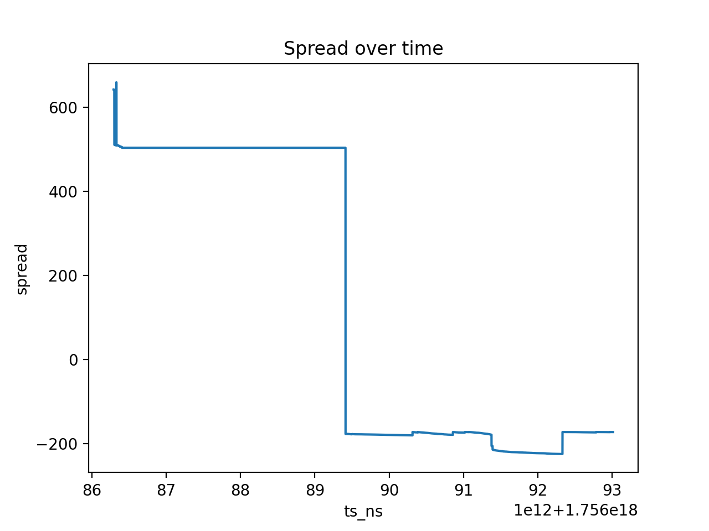

**Mid vs Microprice**  
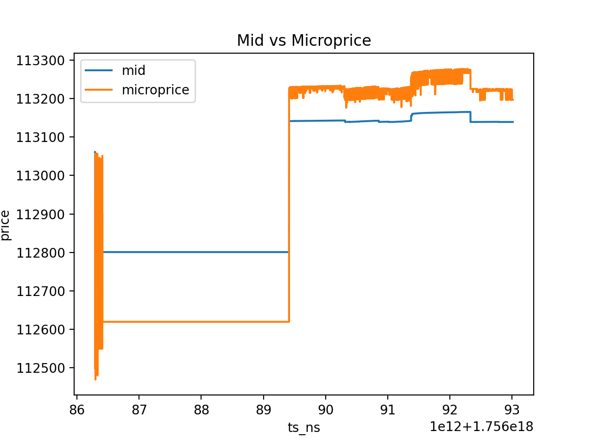

**Best-level imbalance (L1)**  
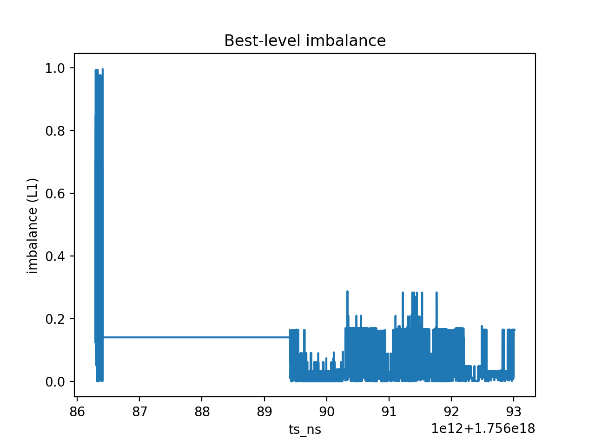

**Top-10 Bid Depth**  
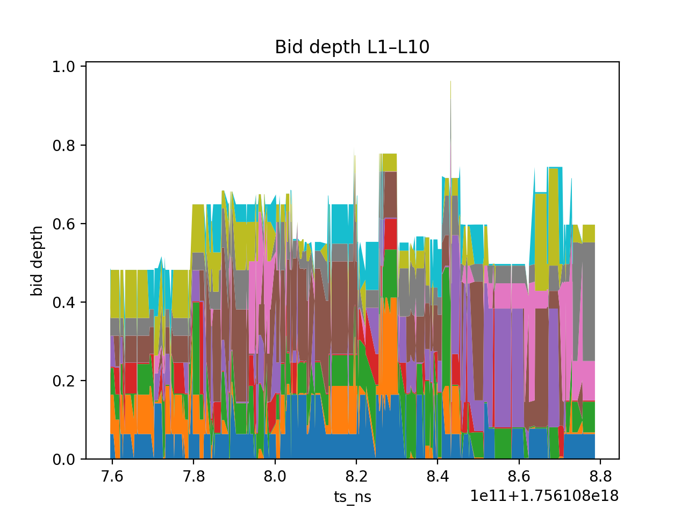

**Top-10 Ask Depth**  
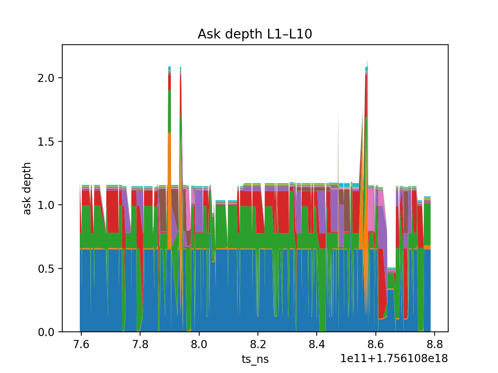

---

### 📊 Microstructure Analytics (volatility, impact, flow, imbalance, clustering)

This repository includes a Python module that computes **microstructure metrics** from TAQ-style quotes/trades (and optional depth), and produces reproducible figures + a JSON summary.

---

#### 🔍 What it computes
- **Realized volatility (Parkinson & Garman–Klass)** on mid-price (best bid/ask).  
- **Impact curves**: average **future mid move** (bp) vs **trade size** buckets (notional deciles & size percentiles), across horizons (e.g., 0.5s, 1s).  
- **Order-flow autocorrelation** from signed trades.  
- **Short-horizon drift vs L1 imbalance** (decile bins).  
- **Clustering of impact-curve shapes** (k-means) to reveal execution regimes.  

---

#### ⚙️ Key design choices
- Robust time joins via `merge_asof` + **uniform drift grid** (`shift(-k)` makes future-mid trivial).  
- Schema flexibility: supports both **wide** and **tidy** depth; falls back to quote sizes when depth doesn’t overlap.  
- Timestamp normalization (s/ms/µs → ns) and coverage extension to avoid empty joins.  
- Outputs: **PNGs** and a **JSON** summary for downstream analysis or reporting.  

---

#### ▶️ Usage (example)
```bash
python -m olob.microstructure \
  --quotes taq_quotes.csv \
  --trades taq_trades.csv \
  --depth-top10 recon/YYYY-MM-DD/<exchange>/<symbol>/top10_depth.parquet \
  --plots-out analytics/plots \
  --out-json analytics/microstructure_summary.json \
  --bar-sec 60 --rv-window 30 \
  --impact-horizons-ms 500,1000 \
  --autocorr-max-lag 50 \
  --drift-grid-ms 1000 \
  --debug-out analytics/debug
```

---

#### 📦 Generated artifacts

**Figures (PNG)**  
- `analytics/plots/vol.png` — Annualized Parkinson & Garman–Klass on mid.  
- `analytics/plots/impact.png` — Impact curves: future mid (bp) vs size buckets.  
- `analytics/plots/oflow_autocorr.png` — Signed trade autocorrelation by lag.  
- `analytics/plots/drift_vs_imbalance.png` — Future drift (bp) by L1 imbalance decile.  
- `analytics/plots/impact_clusters.png` — Cluster centroids of impact-curve shapes.  

**Summary (JSON)**  
- `analytics/microstructure_summary.json`  

---

#### 📈 Diagrams

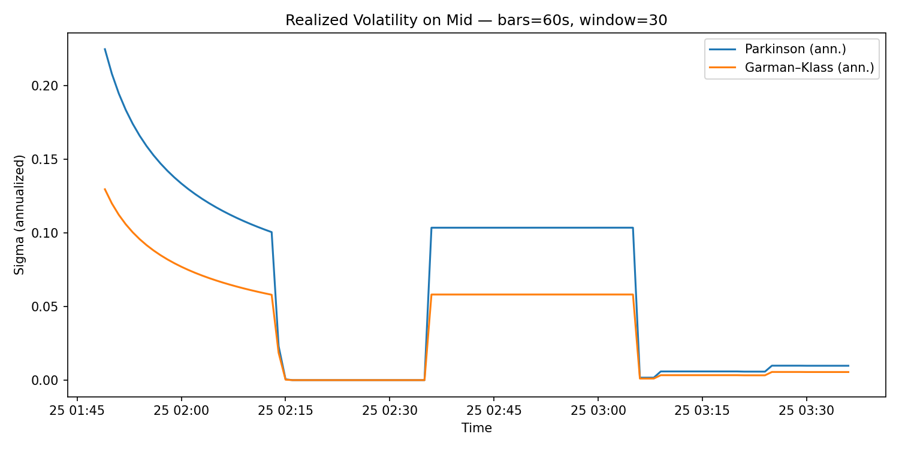  
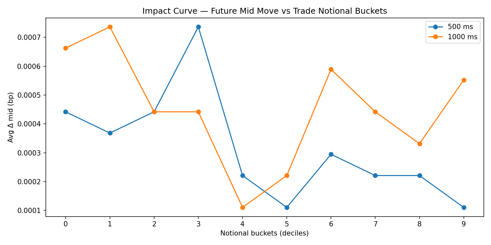  
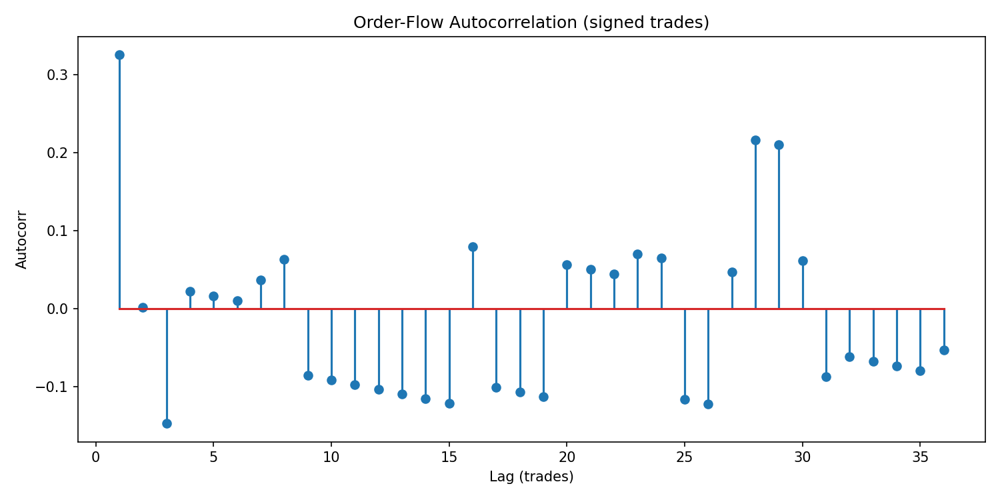  
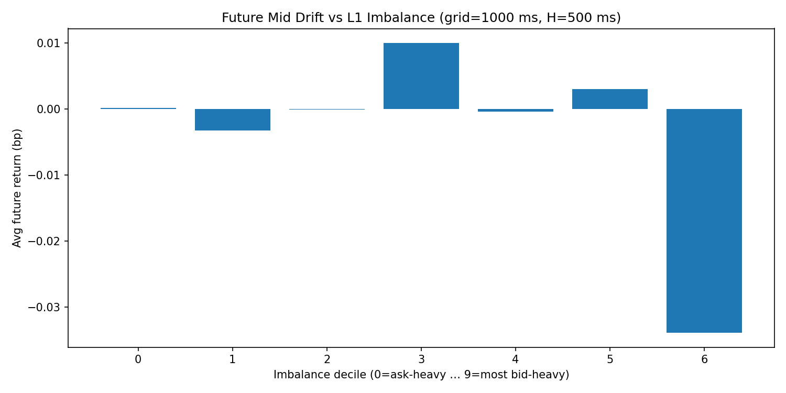  
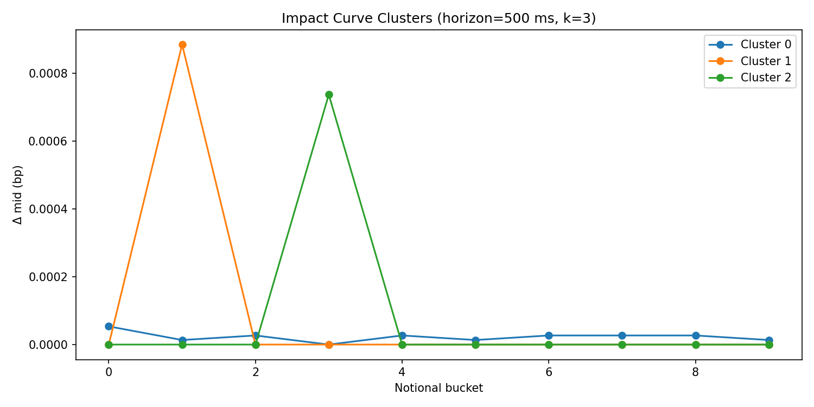  

---

## 📑 HTML Report Generator

A single command produces a **self-contained HTML report** with plots and stats from captured market data.

---

### 🔧 Usage
```bash
lob analyze --exchange binanceus --symbol BTCUSDT \
  --date 2025-08-25 --hour-start 03:00
```

---

### 📋 What it does
- Slices a **1-hour window** from normalized Parquet data.  
- Replays events through the native **`replay_tool`** to generate TAQ-style quotes & trades.  
- Runs analytics: **spread, microprice, imbalance, depth**.  
- Runs microstructure metrics: **realized volatility, impact curves, order-flow autocorr, imbalance drift, clustering**.  
- Emits a single HTML file with embedded PNGs + JSON stats:  
  ```
  out/reports/2025-08-25_BTCUSDT.html
  ```

---

### 📈 Sample Output (report sections)
- Spread over time  
- Mid vs Microprice  
- Best-level imbalance (L1)  
- Depth (bid/ask top-10)  
- Realized Volatility  
- Impact Curves  
- Order-Flow Autocorrelation  
- Drift vs Imbalance  
- Impact Clusters  

---

### 🌐 Portability
The HTML report is fully **self-contained** — just open it in any browser, no external files needed.


## 🎯 Summary

- **Low-latency hot path**: arenas, branch minimization, cache locality.  
- **Exchange semantics**: FIFO fairness, flags (`IOC/FOK/POST_ONLY/STP`), cancel/modify.  
- **Measurement discipline**: benchmarks with CSV artifacts and reproducible docs.  
- **Practical integration**: replayable snapshots and a Python data connector with real exchange capture.
